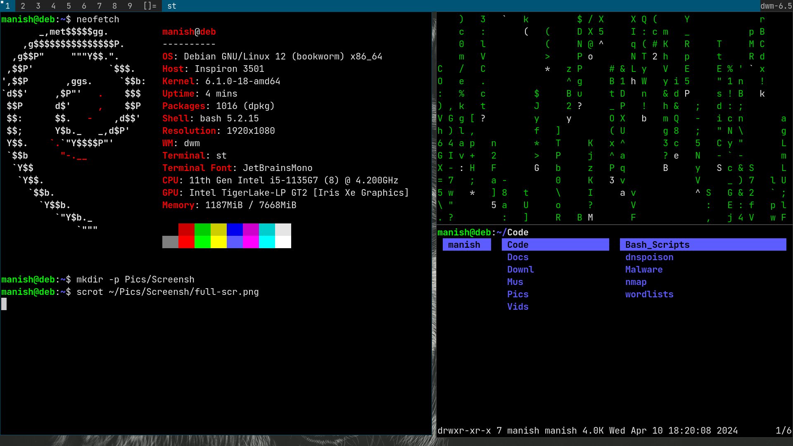

# arch-install
A simple script to quick install my implementation of Arch Linux. It is a minimal operating system with dwm and other suckless utils, and a bunch of other minimal programs (mostly). I use this distribution mainly for coding and exploring security.

## Screenshots.
The final distribution looks like this:
